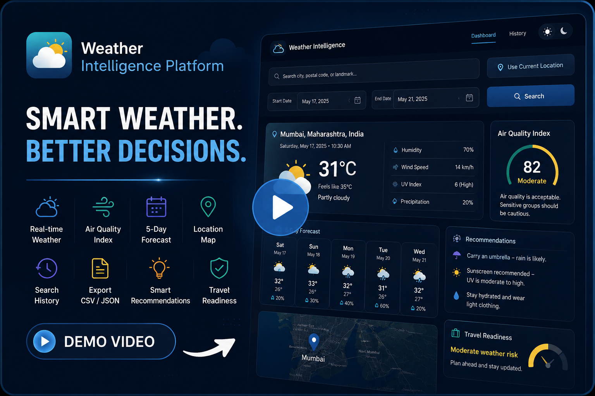

# 🌦️ Weather Intelligence Platform

A full-stack weather application that provides real-time weather insights, 5-day forecasts, air quality information, location-based recommendations, and weather history management.

---

## ✨ Features

* 🔍 Search weather by city or postal code
* 📍 Get weather for your current location
* 🌤️ View real-time weather conditions
* 📅 Explore a 5-day weather forecast
* 🌫️ Check air quality index (AQI)
* 🗺️ Visualize locations on an interactive map
* 💡 Receive smart weather recommendations
* 🧳 View travel readiness insights
* 🗂️ Manage search history with CRUD operations
* 📤 Export stored data as CSV or JSON
* 🌙 Toggle between light and dark themes
* 📱 Fully responsive design

---

## 🎥 Demo Video

Click the thumbnail below to watch the project demo.
[](https://youtu.be/jDlsOY0jEvQ)

---

## 🛠️ Tech Stack

### Frontend

* React
* Vite
* Tailwind CSS
* React Router
* Axios
* React Leaflet

### Backend

* Node.js
* Express.js
* Prisma ORM
* SQLite

### APIs

* Open-Meteo Weather API
* Open-Meteo Geocoding API
* Open-Meteo Air Quality API
* OpenStreetMap / Leaflet

---

## 🚀 Getting Started

### Clone the repository

```bash
git clone <repository-url>
cd weather-intelligence-platform
```

### Install dependencies

#### Frontend

```bash
cd frontend
npm install
```

#### Backend

```bash
cd backend
npm install
```

### Configure environment variables

Create a `.env` file inside the `backend` directory:

```env
PORT=5000
DATABASE_URL="file:./dev.db"
FRONTEND_URL=http://localhost:5173
```

### Initialize the database

```bash
npx prisma migrate dev
npx prisma generate
```

### Run the application

#### Start the backend

```bash
npm run dev
```

#### Start the frontend

```bash
npm run dev
```

Frontend: `http://localhost:5173`

Backend: `http://localhost:5000`

---

## 📂 Project Structure

```text
weather-intelligence-platform/
├── frontend/
├── backend/
├── docs/
└── README.md
```

---

## 👨‍💻 Developer

**Ayush Mayekar**

Built with a focus on simplicity, usability, and practical full-stack engineering.
